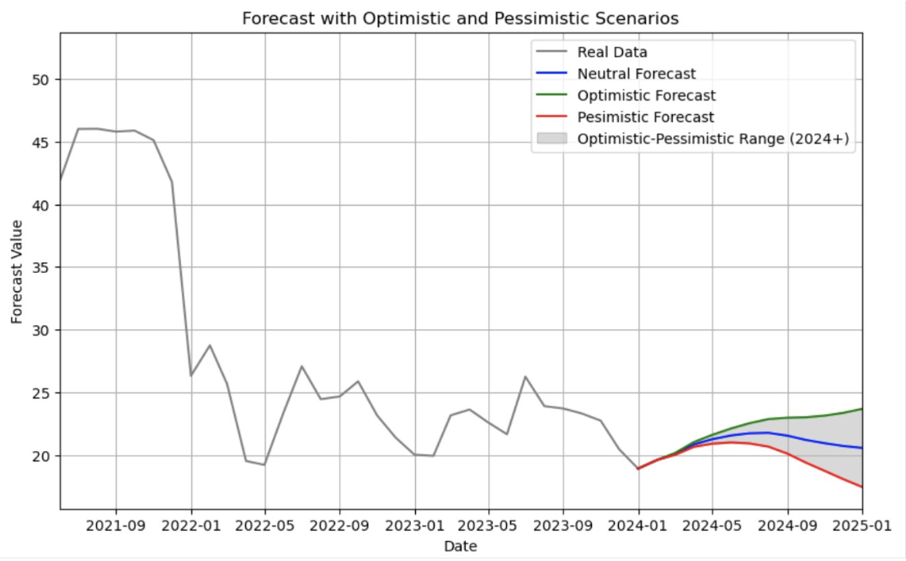

# Passenger and Cargo Count Forecasting

This project focuses on forecasting passenger and cargo counts, creating optimistic and pessimistic scenarios based on various models and analyses.

## Table of Contents
- [Overview](#overview)
- [Literature Analysis](#literature-analysis)
- [PESTLE Analysis](#pestle-analysis)
- [Granger Causality Analysis](#granger-causality-analysis)
- [Univariate and Multivariate Analysis](#univariate-and-multivariate-analysis)
- [Modeling with Gretl](#modeling-with-gretl)
- [Forecast and Scenarios](#forecast-and-scenarios)
- [Results](#results)
- [Conclusion](#conclusion)
- [References](#references)

## Overview
The primary objective of this project is to forecast passenger and cargo counts using various statistical models. We also aimed to develop scenarios (optimistic and pessimistic) to understand potential future trends. The project involved several stages, including literature review, PESTLE analysis, Granger causality analysis, and the use of Gretl for modeling.

## Literature Analysis
A thorough literature review was conducted to understand the existing methods and approaches used in forecasting passenger and cargo counts. This review helped in identifying key variables and potential methodologies for the analysis.

## PESTLE Analysis
A PESTLE (Political, Economic, Social, Technological, Legal, Environmental) analysis was performed to identify external factors that could impact the passenger and cargo counts. This analysis provided a comprehensive view of the macro-environmental factors affecting the forecast.

## Granger Causality Analysis
Granger causality analysis was conducted to identify variables that have a significant impact on the target variables (passenger and cargo counts). This analysis helped in understanding the cause-and-effect relationships and selecting appropriate variables for the models.

## Univariate and Multivariate Analysis
Both univariate and multivariate analyses were performed to explore the data and understand the relationships between different variables. This step involved examining the statistical properties of the data and identifying patterns and trends.

## Modeling with Gretl
Using Gretl, modern ex-post and ex-ante models were developed. These models incorporated the findings from the previous analyses and were used to forecast future values of passenger and cargo counts. The models were evaluated based on RMSE and MAPE to ensure their accuracy and reliability.

## Forecast and Scenarios
Based on the best-performing model, forecasts were generated for passenger and cargo counts. Two scenarios, optimistic and pessimistic, were developed to understand the range of possible future outcomes. These scenarios help in planning and decision-making by providing insights into potential risks and opportunities.

## Results
The results section includes the detailed findings from the models, including the RMSE and MAPE values for different models. The best-performing model was identified and used for generating the forecasts and scenarios. 

 <!-- Update with the actual path to your image -->

## Conclusion
The project successfully developed accurate models for forecasting passenger and cargo counts. The scenarios provide valuable insights for strategic planning and risk management. The combination of literature review, PESTLE analysis, Granger causality analysis, and advanced modeling techniques ensured a robust and comprehensive analysis.

## References
- Include references to any literature or sources used in the project.
